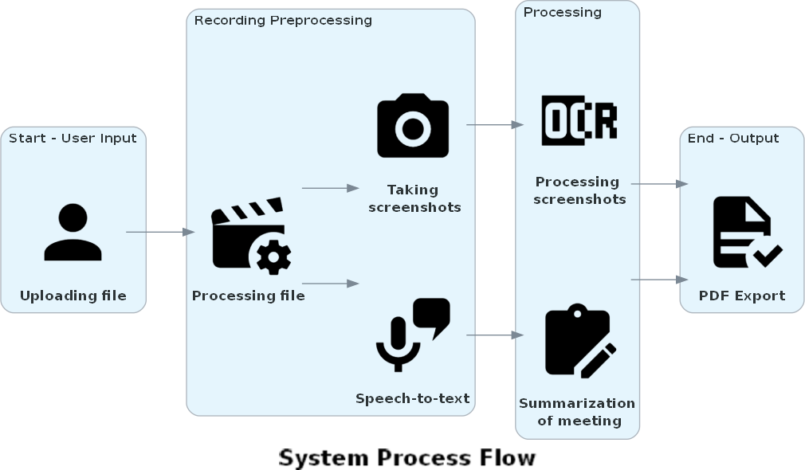
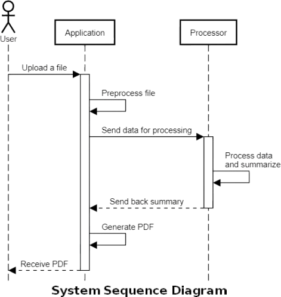

# Requirements Engineering Document

# Team skills matrix

| Skill | Piotr Flak | Dominik Kozieł | Michał Pędziwiatr |
| ----- | ---------- | -------------- | ----------------- |
| Python programming | 
Good
 | 
Good
 | 
Good
 |
| Software testing | 
N/A
 | 
Basic
 | 
N/A
 |
| Scrum | 
Basic
 | 
Basic
 | 
Basic
 |
| C/C++ programming | 
Basic
 | 
Basic
 | 
Basic
 |
| Documentation | 
Intermediate
 | 
Basic
 | 
Intermediate
 |
| Desktop application development | 
Basic</a> | 
Intermediate
 | 
Basic</a> |

# General Q&A

| Question | Answer | Additional notes | 
| -------- | ------ | ---------------- |
| What file formats should be supported? | .pdf, .txt | Maybe .md |
| Which platforms will be supported? | MS Teams, Zoom, Google Meet | |
| Which language will be supported? | Polish, English | |
| How or will this software make life easier? | Yes | The meeting will be summarized in easy to read form at the end of the meeting |
| How long meetings should be processed by the software? | It will be adjustable | This option will be available in settings |
| Will the notes displayed during the meeting be processed by the app? | Yes | Hand-written notes will be recognized by OCR |

# Expected outline of application usage

The application aims to create accessible notes and summaries from meetings on platforms such as MS Teams, Zoom and Google Meet. The notes should be generated as follows:

1. User opens the meeting screen.
2. User runs the application with proper (meeting) window selected from the list.
3. Application simultaneously process the audio with speech to text technology. and saves dialogs in .txt file. Application worker takes screenshot of meeting window every one second for future processing needs.
4. When meeting ends, user is obligated to stop application capturing process.
5. Post processing as a result will return .pdf file with summarized topics addressed at the meetings and notes read from screenshots taken during meeting.
    > [!NOTE]
    > Post processing time may vary depending on the length of the online meeting

# Generated note schema visualization

    

        <h1 class='note'>Title</h1>
    

    
  
        

            Lorem Ipsum is simply dummy text of the printing and typesetting industry. Lorem Ipsum has been the industry's standard dummy text ever since the 1500s, when an unknown printer took a galley of type and scrambled it to make a type specimen book.
        

        

            
        

        

            It has survived not only five centuries, but also the leap into electronic typesetting, remaining essentially unchanged. It was popularised in the 1960s with the release of Letraset sheets containing Lorem Ipsum passages, and more recently with desktop publishing software like Aldus PageMaker including versions of Lorem Ipsum.
        

    

*Draft of an expected note*

Generated note should contain:
- Title of meeting
- crucial parts of speech transcription
- important screenshots taken during meeting
- screenshot transcription based on OCR technology
- summarization of notes at the end of files.

# Architecture design of the system under development

# Implementation and work schema

## Requirements

- [Python](https://www.python.org)
  - [PyQT](https://doc.qt.io/qtforpython-6/)
  - [Tesseract](https://pypi.org/project/pytesseract/)
  - [SpeechRecognition](https://pypi.org/project/SpeechRecognition/)
- [Docker](https://www.docker.com)
- Windows 11

## Organization framework

- Agile - framework based on regular meetings, breaking the project into phases and frequent reports.
- [Slack](https://slack.com) - application used for communication
- [Github repository](https://github.com/PFlak/IO-Projekt) - code repository with branches, pull requests and other essential tools for developers 
- [Trello](https://trello.com/pl) - web application for setting up tasks and managing team for optimal work.
